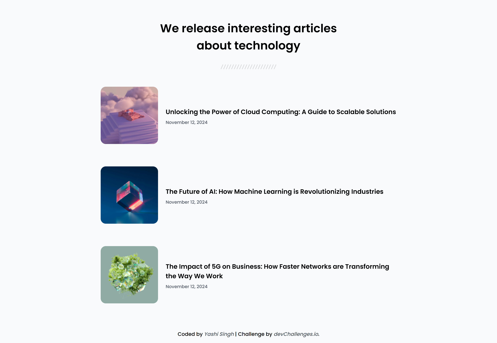
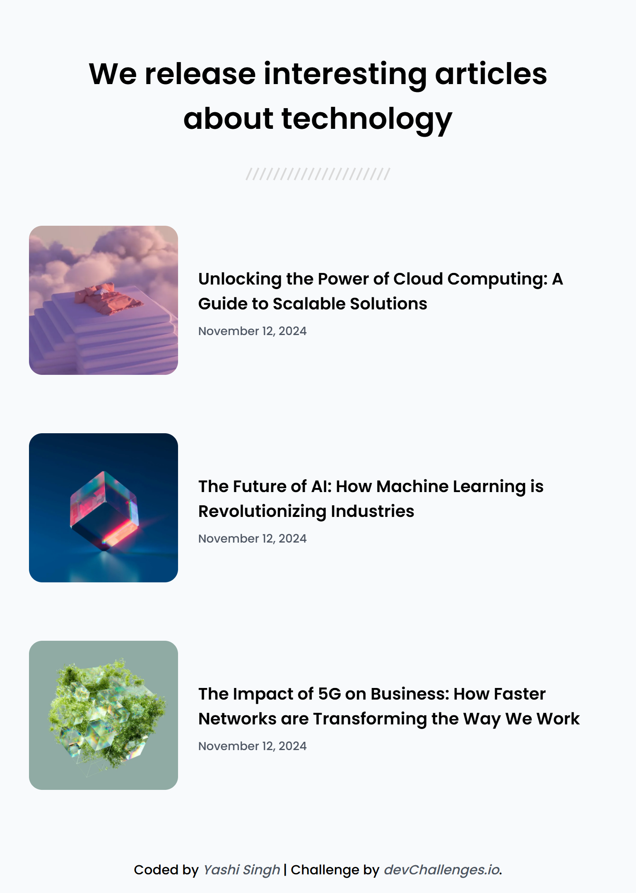
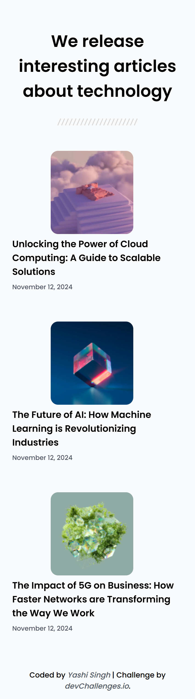

<h1 align="center">Simple Article Listing | devChallenges</h1>

<div align="center">
   Solution for a challenge <a href="https://devchallenges.io/challenge/simple-article-listing" target="_blank">Simple Article Listing</a> from <a href="http://devchallenges.io" target="_blank">devChallenges.io</a>.
</div>

<div align="center">
  <h3>
    <a href="https://yashi-singh-9.github.io/Simple-Article-Listing/">
      Demo
    </a>
    <span> | </span>
    <a href="https://devchallenges.io/solution/51315">
      Solution
    </a>
    <span> | </span>
    <a href="https://devchallenges.io/challenge/simple-article-listing">
      Challenge
    </a>
  </h3>
</div>

---

## 📌 Table of Contents

- [Overview](#overview)
  - [What I Learned](#what-i-learned)
  - [Useful Resources](#useful-resources)
  - [Screenshot](#screenshot)
- [Project Structure](#project-structure)
- [Built With](#built-with)
- [Features](#features)
- [Project Checklist](#project-checklist)
- [Acknowledgements](#acknowledgements)
- [Author](#author)

---

## 🚀 Overview

This project is a responsive, mobile-first article listing web page built with semantic HTML5 and CSS3. It displays a series of articles—each featuring an optimized image (via `<picture>` and `srcset`), a title, and a publication date—arranged in a clean, flexible layout powered by Flexbox. Clean spacing, modern typography, hover animations, and fade-in effects enhance the user experience, while semantic structure and accessibility best practices ensure SEO-friendly, user-friendly performance across all devices.

---

## 📁 Project Structure

```

simple-article-listing/
│
├── index.html               # Main HTML file
├── style/
│   └── style.css            # CSS styles
├── resources/
│   ├── photo\_1.png
│   ├── [photo\_1@2x.png](mailto:photo_1@2x.png)
│   ├── photo\_2.png
│   ├── [photo\_2@2x.png](mailto:photo_2@2x.png)
│   ├── photo\_3.png
│   ├── [photo\_3@2x.png](mailto:photo_3@2x.png)
│   ├── Seperator.svg
│   └── favicon.ico          # Website favicon
└── README.md                # Project README

```

---

### ✅ What I Learned

- Responsive image handling using the `<picture>` element and `srcset`
- Creating animation effects using `@keyframes`
- How to enhance user experience with hover transitions and flexible layouts
- Structuring content semantically for accessibility and SEO

---

### 📚 Useful Resources

- [MDN Web Docs - Responsive Images](https://developer.mozilla.org/en-US/docs/Learn/HTML/Multimedia_and_embedding/Responsive_images)
- [CSS Tricks - A Complete Guide to Flexbox](https://css-tricks.com/snippets/css/a-guide-to-flexbox/)
- [Google Fonts - Poppins](https://fonts.google.com/specimen/Poppins)
- [Bootstrap 5 Documentation](https://getbootstrap.com/docs/5.3/getting-started/introduction/)

---

### 📷 Screenshot

**Desktop Design**  


**Tablet Design**  


**Mobile Design**  


---

## 🛠 Built With

- Semantic HTML5
- CSS3
- Flexbox
- CSS Animations
- Mobile-first responsive design
- [Bootstrap 5](https://getbootstrap.com/)

---

## ✨ Features

This site was created as a submission to a [DevChallenges](https://devchallenges.io/challenges-dashboard) challenge.

- ✅ Fully responsive design
- ✅ Clean and modern layout
- ✅ Flexbox-based article listing
- ✅ Hover and animation effects
- ✅ Semantic and accessible HTML
- ✅ Easy to navigate and visually consistent

---

## ✅ Project Checklist

- ✅ Create a responsive web page that displays a list of articles using HTML and CSS
- ✅ Each article includes a picture, title, and publication date
- ✅ Implement flexbox to create a visually appealing and responsive layout
- ✅ Apply clean spacing and typography to enhance design
- ✅ Ensure the web page is accessible and user-friendly
- ✅ Test the web page on different devices and screen sizes
- ✅ Optimize the web page for performance and loading speed (e.g., use of `srcset` for images)
- ✅ Use semantic HTML elements to improve SEO
- ✅ Apply CSS styles to enhance visual presentation
- ✅ Add hover effects or animations for interactivity
- ✅ Validate HTML and CSS for best practices (passed based on structure)
- ✅ Document the code and provide clear instructions on how to use
- ✅ Deploy the website to make it accessible to everyone

---

## 🙌 Acknowledgements

- [DevChallenges](https://devchallenges.io/) for the inspiration and design guidelines
- MDN and CSS-Tricks for tutorials and reference materials
- [Bootstrap](https://getbootstrap.com/) – for utility classes and layout assistance

---

## 👩‍💻 Author

- LinkedIn: [Yashi Singh](https://www.linkedin.com/in/yashi-singh-b4143a246)

---

⭐ Feel free to fork this repository, give it a ⭐, or suggest improvements!
